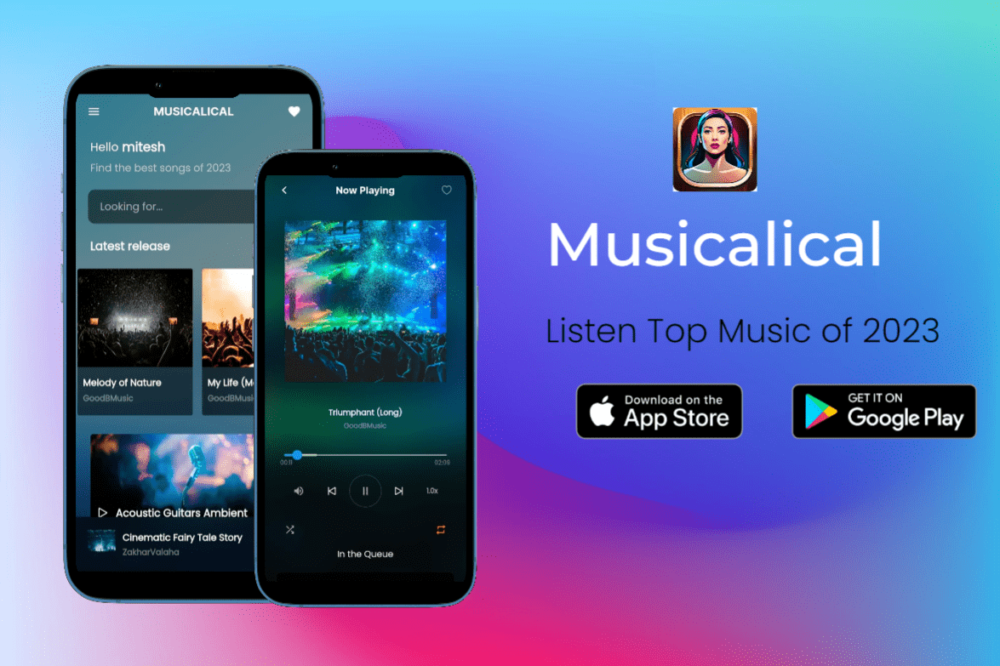
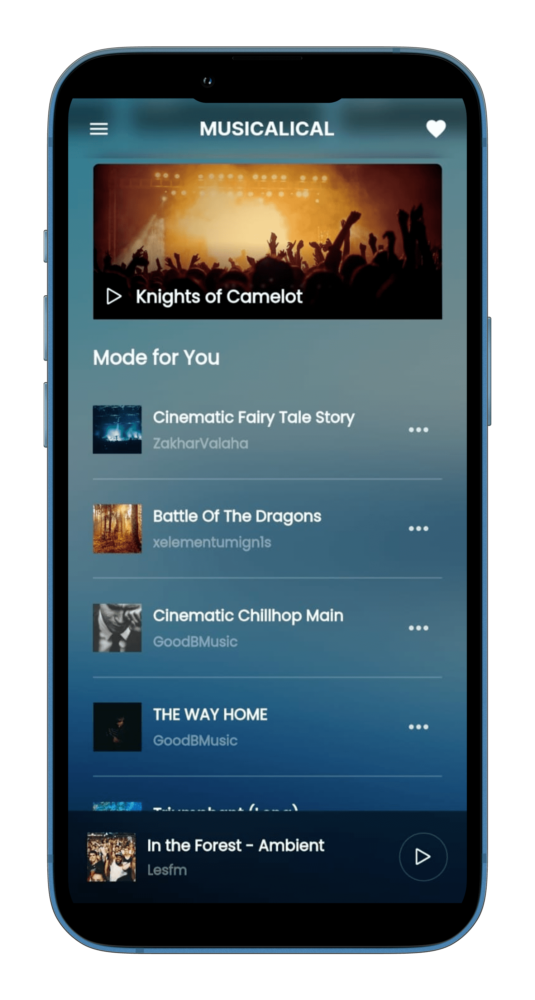
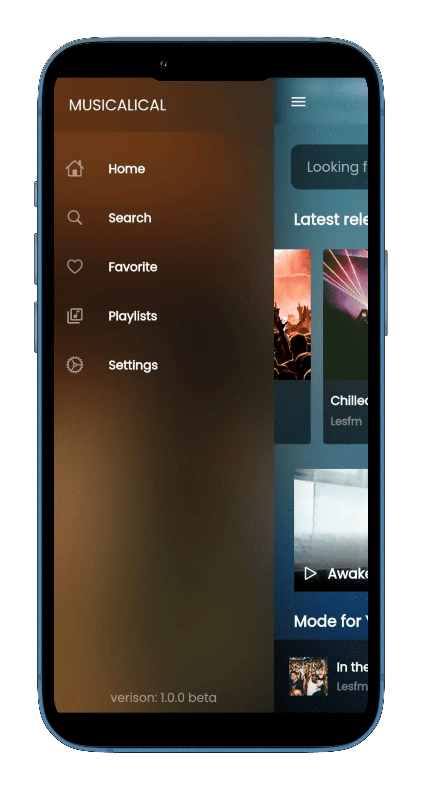
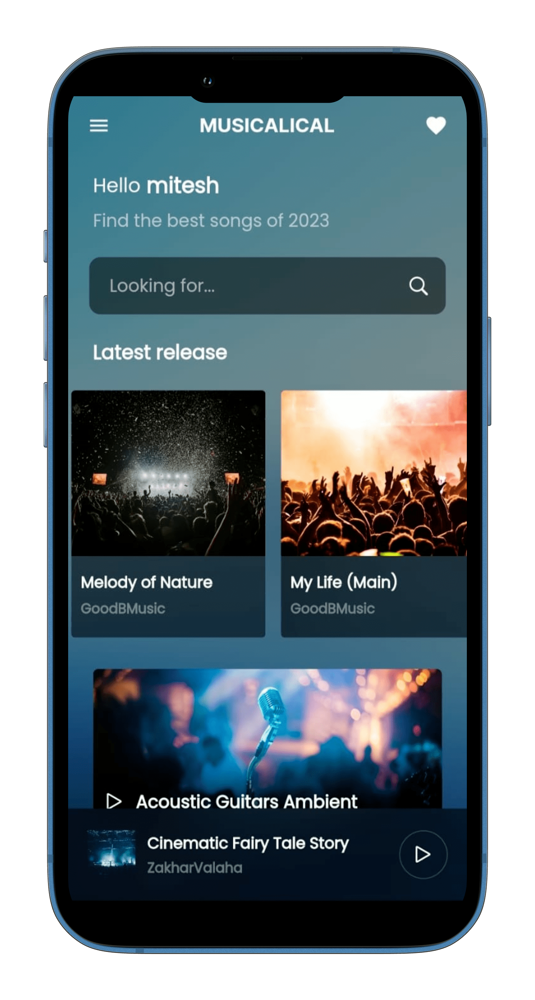
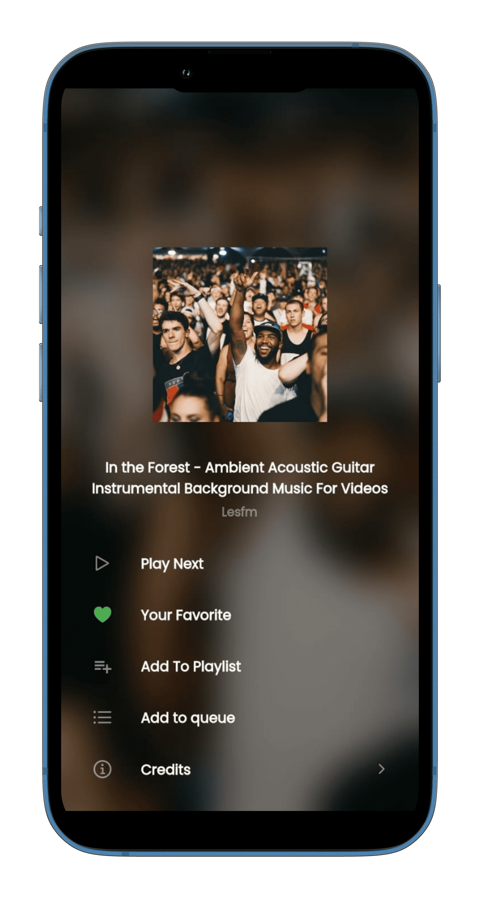
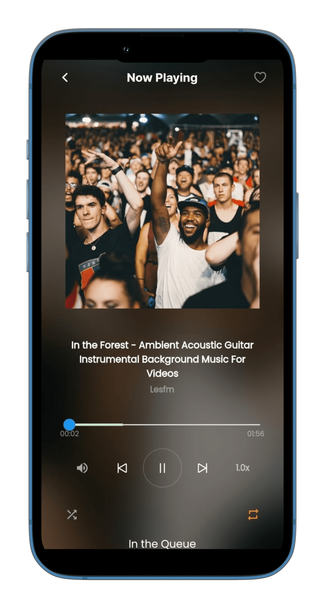
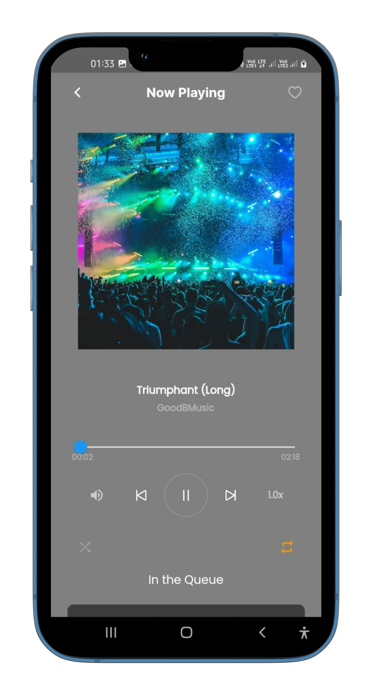
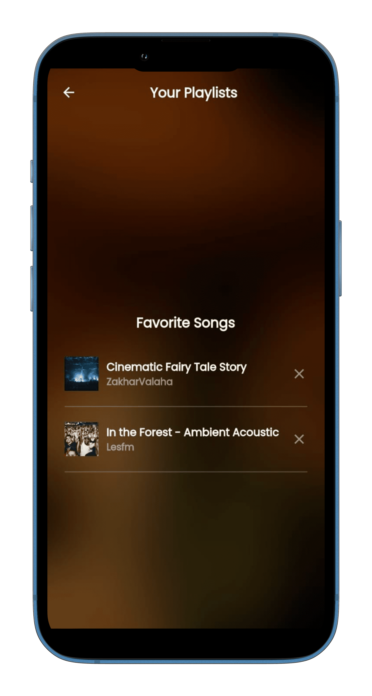
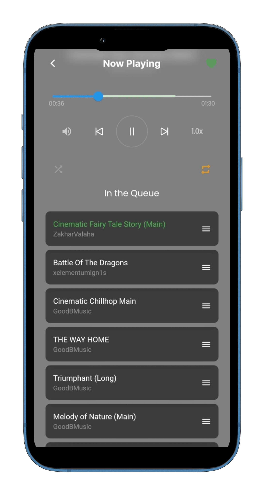
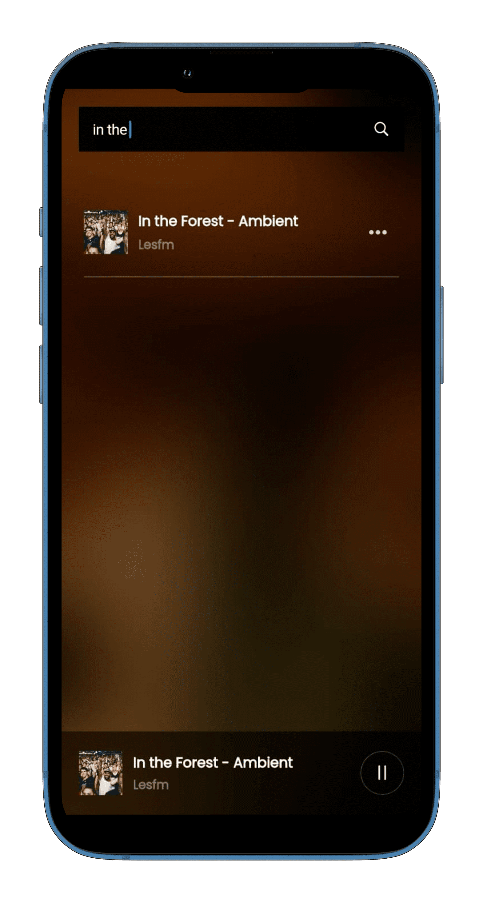

# **Musicalical** 

- App Link: [Click Me!]()
- Demo Video: [Click Me!]()

## Table of contents
- [**Musicalical**](#musicalical)
  - [Table of contents](#table-of-contents)
  - [Learn Flutter](#learn-flutter)
      - [Why Flutter?](#why-flutter)
  - [Need Help / Contribute 🚨](#need-help--contribute-)
  - [Overview](#overview)
  - [My process](#my-process)
    - [What I learned](#what-i-learned)
      - [Dependencies](#dependencies)
    - [Built with](#built-with)
  - [🖥️ Tech Stack](#️-tech-stack)
    - [🚀 Features🔥](#-features)
    - [😇 Upcoming Features🔥](#-upcoming-features)
  - [Sneak Peek 🙈](#sneak-peek-)
  - [Useful resources](#useful-resources)
  - [📬 Contact](#-contact)

## Learn Flutter 

This project is a starting point for a Flutter application. A few resources to get you started if this is your first Flutter project:

- [Lab: Write your first Flutter app](https://flutter.dev/docs/get-started/codelab)
- [Cookbook: Useful Flutter samples](https://flutter.dev/docs/cookbook)

For help getting started with Flutter, view our
[online documentation](https://flutter.dev/docs), which offers tutorials,
samples, guidance on mobile development, and a full API reference.

#### Why Flutter?  
- Flutter offers cross-platform development, allowing you to build mobile apps for both iOS and Android using a single codebase, reducing development time and costs.
- Its hot reload feature enables developers to see changes in real-time, making the development process faster and more efficient.
- Flutter provides a rich set of customizable widgets and a responsive UI framework, enabling developers to create visually stunning and native-like user experiences for their apps.

## Need Help / Contribute 🚨
- We are building an initial release🤞 Our product will be launched very soon✔
- Need More Contributors and maintainers🤝
If intersted kindly contact [Here](#📬-contact)

## Overview

Welcome to Musicalical, where melody meets technology! Our innovative online music application brings the rhythm to your fingertips. Explore a vast collection of songs from various genres, curated playlists, and personalized recommendations. With a sleek and user-friendly interface, enjoy seamless streaming, create your own playlists, and discover new tunes to amplify your musical journey. Experience the harmony of convenience and musical bliss with Musicalical!

## My process

- To enhance my skills in Flutter development, I implemented incremental components of projects to excel in my development abilities.
- **All Links are in [Useful resources](#useful-resources).**

### What I learned
- Exploration of Flutter List and More UI components
- Explored API integration with Flutter and State Management.
- learn about Hive a lightweight and fast NoSQL database for Flutter and Dart to store data locally in Flutter app.
- I gained an in-depth comprehension of Flutter and Android architecture, delving into the intricacies and exploring a wide range of cool and practical dependencies.

#### Dependencies

- hive: ^2.0.4
- hive_flutter: ^1.1.0
- fluttertoast: ^8.0.8
- google_fonts: ^4.0.0
- intl: ^0.17.0
- just_audio: ^0.9.11

### Built with

- Flutter

## 🖥️ Tech Stack

**Frontend:**

&nbsp;

### 🚀 Features🔥

- Search a Music
- Add your song in favourites
- Listen music in background

### 😇 Upcoming Features🔥

- Global Music Library

## Sneak Peek 🙈

 

 

## Useful resources

- [Flutter & Dart - The Complete Guide [2023 Edition]](https://www.udemy.com/course/learn-flutter-dart-to-build-ios-android-apps/) - This is the Udemy Course that i followed to learn Flutter Development.
- [Codepur](https://www.youtube.com/@HelloCodepur) - This is the Youtube Channel that i followed to learn Flutter In Hindi( Best YT channel for Flutter💙 ).
- Must Try :- [Official Documentation](https://docs.flutter.dev/)
- Also Some Online Blogs and Articles.

## 📬 Contact

If you want to contact me, you can reach me through below handles.

© 2023 Mitesh Tank ❤

